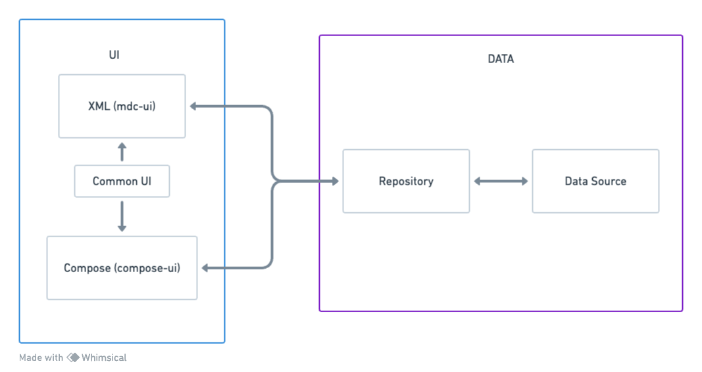

# Android XML - Compose Sample App (Phonebook)

A sample Android app showcasing two different UI architectures - Jetpack Compose and Traditional
XML - sharing resources and data to achieve an identical appearance. The project employs a fake data
source for practical demonstration purposes.

## Project Overview

In this project, I've built two small Android applications that leverage distinct approaches to UI
development:

1. **Jetpack Compose App**: Utilizes the modern Jetpack Compose framework for building the user
   interface.

2. **Traditional XML App**: Employs the traditional XML-based approach for UI development.

Both applications share common resources and data components, fostering code reusability and
consistency. This includes shared drawables, strings, models, and repositories. This approach
ensures that both apps, despite using different UI frameworks, maintain a uniform appearance and
functionality. A fake data source is incorporated to simulate real-world scenarios without
relying on an actual backend.

## Getting Started

To run either of the applications, follow these general steps:

1. Clone the repository: `https://github.com/efrenospino/android-xml-compose-phonebook.git`
2. Open the desired module (`ui-compose` or `ui-mdc`) in Android Studio.
3. Build and run the app on an emulator or a physical device.

## Screenshots

|            Traditional XML             |              Jetpack Compose               |
|:--------------------------------------:|:------------------------------------------:|
|  |  |

## Architecture

The app adopts a modular design, dividing into UI, Data, and Shared modules.

### UI Layer for XML (Android Fragments, ViewModels, LiveData)

- **ViewModels:** Manage UI state with Android's ViewModel architecture.
- **LiveData:** Employ LiveData for reactive data updates in UI.
- **Shared Module:** Centralized resources for consistent UI.

### UI Layer for Compose (Compose, ViewModels, Flow)

- **ViewModels:** Handle UI state using Jetpack Compose's ViewModel.
- **Flow:** Utilize Flow for asynchronous data streams in Compose UI.
- **Shared Module:** Common resources for a cohesive design language.

### Data Layer

- **Repository Pattern:** Abstract data sources for seamless access.
- **Coroutines:** Utilize Kotlin coroutines for efficient asynchronous operations.
- **Modularization:** Organize data sources into distinct modules (e.g., LocalDataSource,
  RemoteDataSource).

## Contributions

If you've found an error in this sample, please file an issue.

Patches are encouraged and may be submitted by forking this project and submitting a pull request.

## License

This project is licensed under the Apache License Version 2.0 - see the [LICENSE](LICENSE) file for
details.
